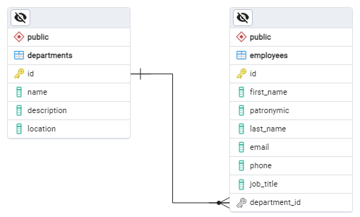

# Digital Chief test case

## Technical specification

Develop a client-server application that implements CRUD operations for Department and Employee entities.

Interaction with the application is performed using REST API.

### Entities:

* Department
    * Identifier
    * Name
    * Description
    * Location
    * Employees
* Employee
    * Identifier
    * First name
    * Patronymic
    * Last name
    * Job title
    * Email
    * Phone
    * Department

### Relationships:

* A Department can have multiple Employees working on it.
* An Employee can only work in one Department.



### Endpoints

* #### Departments

    * `GET /departments` - Retrieve a list of all departments
    * `GET /departments/{id}` - Retrieve a department by ID
    * `POST /departments` - Create a new department
    * `PUT /departments/{id}` - Update an existing department
    * `DELETE /departments/{id}` - Delete a department 

* #### Employees

    * `GET /employees` - Retrieve a list of all employees
    * `GET /employees/{id}` - Retrieve an employee by ID
    * `POST /employees` - Create a new employee
    * `PUT /employees/{id}` - Update an existing employee
    * `DELETE /employees/{id}` - Delete an employee

* #### Department Employees

    * `GET /departments/{departmentId}/employees` - Retrieve a list of employees in a department
    * `POST /departments/{departmentId}/employees` - Add an employees to a department
    * `DELETE /departments/{departmentId/employees/{employeeId}` - Remove an employee from a department

**API documentation is available here: localhost:8080/swagger-ui/index.html**

**Postman collection available here: postman/postman.json. Please import it to test**

## Used technologies

- Java 17
- Spring Boot 3.3.1
  - Spring Data JPA
  - Spring Web
  - Spring Validation
- Swagger
- Hibernate
- Maven
- PostgreSQL
- Git
- Postman

## Usage

* Execute `sql/create-tables.sql` queries
* Write the database access information in the application.yml file.
```yaml
spring:
  application:
    name: digital-chief-test-case
  datasource:
    url: # your db url
    username: # your db username
    password: # your db password
    driver-class-name: org.postgresql.Driver
```
* Execute `mvn spring-boot:run`

